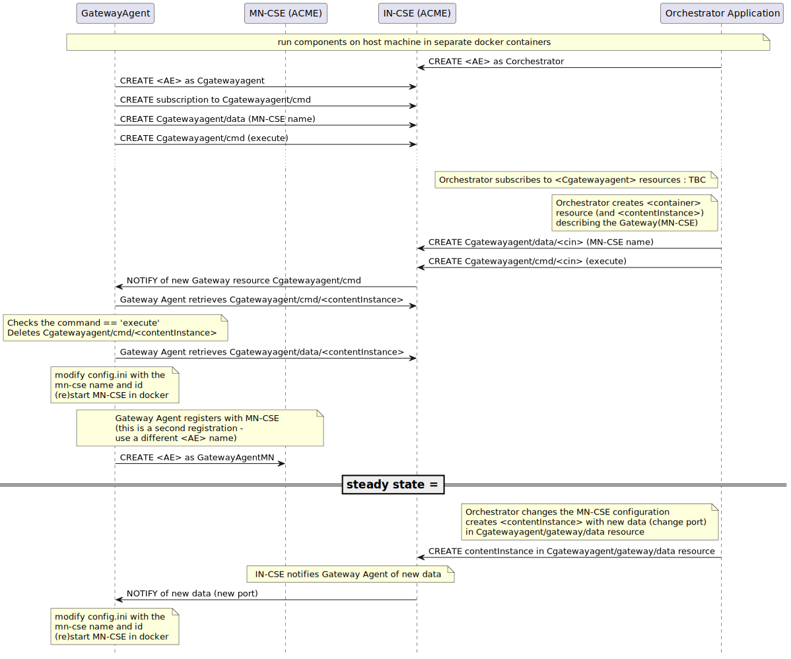

# PSU_CAPSTONE_1S26
oneM2M Orchestrator

## Running CSEs
- Mount and start IN-CSE
~~~sh
docker run -it -p 8080:8080 -e hostIPAddress=localhost -v ./acme_in:/data --name acme-in ankraft/acme-onem2m-cse:latest
~~~


- Check for running container
~~~sh
docker ps
~~~

## Resource tree
```
<CSEBase> "IN-CSE"
└── <AE> "Cgatewayagent"                                 [poa = "http://localhost:9090"]
        ├── <Container> "cmd", mni = 1
        │   └── <ContentInstance> (latest)
        │   └── <Subscription> "sub"                     [nu = "Cgatewayagent"]
        └── <Container> "data"
            ├── <ContentInstance> (oldest)
            ├── <ContentInstance>
            ├── ...
            └── <ContentInstance> (latest)

```

## MSC
PlantUML source file: [media/msc.puml](media/msc.puml)




