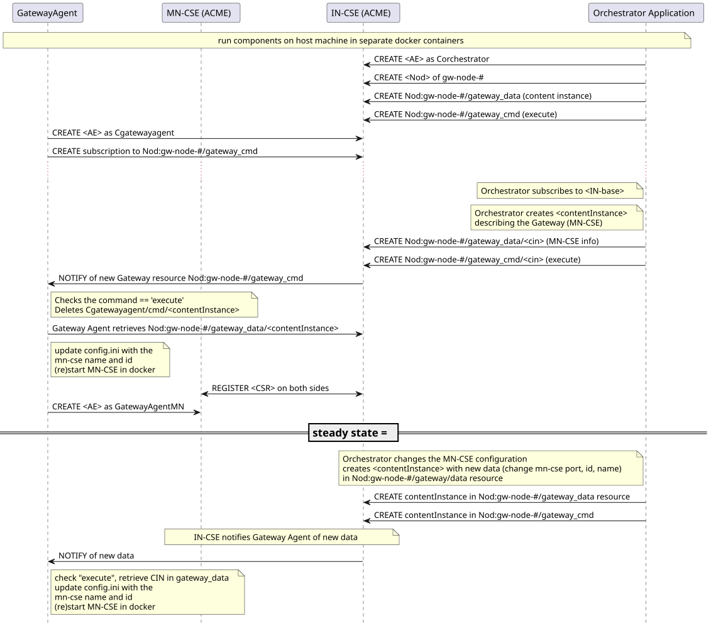

# PSU_CAPSTONE_1S26
oneM2M Orchestrator for Gateway Deployments

## Overview

The primary objective was to
create a more intuitive and efficient method for overseeing distributed device networks within a
oneM2M framework. It provides a visual and interactive way to deploy and monitor MN-CSE instances through Gateway Agents running on edge devices such as Raspberry Pis.

The system is designed around a cental/local orchestration side and an edge execution side. The orchestrator communicates with an IN-CSE, while each Gateway Agent listens for deployment commands, starts or updates MN-CSE containers, and reports status back through oneM2M resources.

The project was developed for Exacta Global Smart Solutions as part of the Penn State CMPSC 483W capstone project.

## Main Features
- Visual network diagram for displaying oneM2M resources and deployment relationships
- Orchestrator UI for provisioning hosts, adding CSEs, and adding AEs
- Automated MN-CSE deployment
- Raspberry Pi edge-device support
- WireGuard VPN support
- Dynamic updates based on oneM2M resource changes

## System Architecture
The high-level architecture is:

~~~text
User
 ^
 |
 | interacts with
 v
Orchestrator UI
 ^
 |
 | creates resources and commands through oneM2M
 v
IN-CSE
^   ^
|   |
|   | sends notifications / registers MN
|   | 
|   v
| MN-CSE
|   ^
|   |
|   | starts and manages
v   | 
Gateway Agent Application
~~~

## Main Components

### Orchestrator
The orchestrator is responsible for user interaction and system visualization. 

- Presentation Layer: The frontend is a single-page dashboard rendered by Django
templates and a static app.js file. It contains three operator workflows, Provision Host,
Add CSE, and Deploy AE, each presented as a modal form, plus a Cytoscape.js topology
diagram and a properties panel. 

- API Layer: Six REST endpoints in api_views.py handle all incoming requests.Each endpoint validates the request,
enforces deployment constraints, delegates to the service layer, and returns a JSON
response with a success flag and the relevant data payload.

- Service Layer: The services.py module is the core business logic and the single source
of truth for the orchestrator's state. It holds the in-memory topology dictionary protected
by a threading lock, dispatches all oneM2M HTTP requests, and manages the lifecycle
of every resource the orchestrator creates. 

### Gateway Agent
The Gateway Agent is responsible for local execution on the edge device.

- Configuration Layer: User can configure their own environment per edge devices, and the application loads environment-specific settings for each gateways host. This layer allows the same Gateway Agent code to run on different Raspberry Pis.

- Notification Receiver Layer: This runs the local callback server as a thread in the background and receives any orchestrator commands of execution.

- Communication Layer: This handles communication with the IN-CSE via oneM2M HTTP requests. All necessary automation functions including AE registration, container creation, content instance retrieval are done in this layer. 

- CSE Management Layer: This layer creates and updates the configuration file required by the ACME MN-CSE and deploys proper MN-CSE. It also interacts with Docker to inspect any existing CSEs and handles error.

### CSEs
CSEs establish a oneM2M Common Service Layer. The project uses ACME oneM2M CSE as the oneM2M middleware implementation.
- The IN-CSE acts as the central infrastructure node.
- MN-CSE instances are deployed on edge hosts by the Gateway Agent.
- MN-CSEs register with the IN-CSE as CSRs. 

### SBCs
Raspberry Pis are used as edge hosts node for the Gateway Agent and deployed MN-CSE containers. Each Pi runs the application inside Docker and connects to the orchestrator side through WireGuard VPN.

For more information about VPN,
[View Wireguard StartUp](docs/WIREGUARD_STARTUP_PACKAGE.md)

## Installation and Configuration
- Download or clone this repository to a local directory.

- Install the necessary Python packages with the following command.

~~~sh
pip3 install -r requirements.txt
~~~

### Configuration
- IN_CSE_BASE_URL: The URL of the IN-CSE
- ORIGINATOR_ID: Originator ID to access the CSE.
- CALLBACK_URL: The URL of the notification server on each edge device
- APPLICATION_NAME: THe application name of the gateway agent
- SUBSCRIPTION_NAME: The subscription name of the gateway agent
- IMAGE: The URL of gateway agent application image. Fill in after you build the docker image.
- ACME_IMAGE: The URL of default CSE image to use
- GATEWAY_HOST_ADDR: The IP address of edge device
- HOST_CSE_BASE_DIR: The directory name inside Docker to store CSE configuration files
- CONTAINER_CSE_BASE_DIR: The directory name inside host machine to store CSE configuration files
- DOCKER_HOST: unix:///var/run/docker.sock

## Building and running your application

### Workflow
1. Build your application image and configure its url
2. Start IN-CSE
3. Start orchestrator server
4. Start gateway agent application

### Deploying your application to the cloud

First, build your image, e.g.: `docker build -t myapp .`.
If your cloud uses a different CPU architecture than your development
machine (e.g., you are on a Mac M1 and your cloud provider is amd64),
you'll want to build the image for that platform, e.g.:
`docker build --platform=linux/amd64 -t myapp .`.

Then, push it to your registry, e.g. `docker push myregistry.com/myapp`.

Consult Docker's [getting started](https://docs.docker.com/go/get-started-sharing/)
docs for more detail on building and pushing.

### Start server
~~~sh
python3 manage.py runserver
~~~

### Start IN-CSE
~~~sh
docker run -d -p 8080:8080 -e hostIPAddress=10.0.0.1 -v ./acme_in:/data --name acme-in --
network acme-net ankraft/acme-onem2m-cse:latest
~~~

### Start GatewayAgent
All images and required files should be pulled in Rasberry Pi beforehand.

~~~sh
docker run -it --name gateway-app1  --env-file .env.rpi1 -p 9000:9000 -v /var/run/docker.sock:/var/run/docker.sock -v /opt/gateway/cse-data:/shared-cse gateway-app:latest
~~~

### MSC
[View PlantUML source](docs/callflow.puml)

## Team
- Anthony Shpilsky
- Jack Jordan
- Minseo Kim
- Tae Hyun Kim
- Pranay Sivaraju

## References
* [Docker's Python guide](https://docs.docker.com/language/python/)
* [oneM2M Jupyter Notebooks](https://github.com/Gimminse/onem2m-jupyter-notebooks)
* [ACME oneM2M CSE](https://acmecse.net/home/oneM2M-introduction/)

